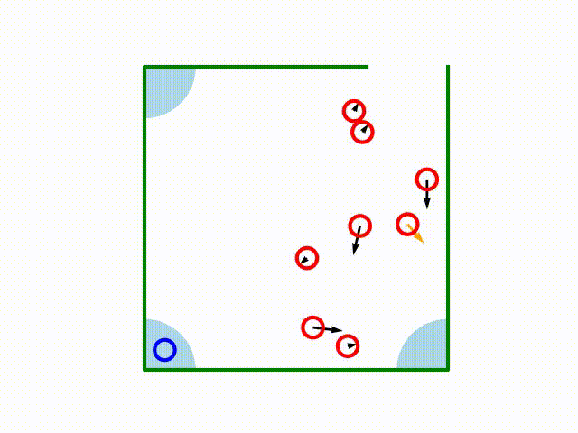
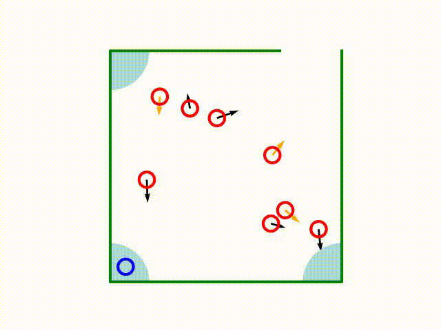

# Reconnaissance for Reinforcement Learning with Safety Constraints    

This repository is an official implementation of Reconnaissance for Reinforcement Learning with Safety Constraints [[paper]](https://arxiv.org/abs/1909.09540).

For FrozenLake env, please see `frozenlake.ipynb` [here](frozenlake.ipynb).   
For high-dimensional environments, see the followings.

## Videos
Behaviors of Jam agents:
|DQN with small penalty |DQN with large penalty| RP (Ours)|
|:---:|:---:|:---:|
|  | |  |

You can find more short videos in `videos/` that show how the agent of each method acts in Circuit and Jam.

## Requirements
You can use either Anaconda or Docker. 
### Anaconda
```shell
$ apt install libpng-dev libfreetype6-dev pkg-config git g++ python3-tk
$ conda env create -f environment.yml
$ conda activate rp_env
$ export PYTHONPATH=$PYTHONPATH:`pwd`/rllab
```

You also need to install Theano.
```shell
pip install -e git+https://github.com/Theano/Theano.git@adfe319ce6b781083d8dc3200fb4481b00853791#egg=Theano
```

### Docker
```shell
$ docker build -t rp_env .
```

To enable the rendering, you may need to change some configurations. The easiest (but not completely secure) way is to run the following command in the host before `docker run`
```shell
$ apt install x11-xserver-utils
$ xhost local:
```
then run
```shell
$ docker run -it -v /tmp/.X11-unix:/tmp/.X11-unix -e DISPLAY=unix$DISPLAY rp_env /bin/bash
```
After exiting the container, don't forget to remove the permission.
```shell
$ xhost -local:
```

### MuJoCo
For PointGather, we additionally need [MuJoCo](http://www.mujoco.org/).  
Please download mjpro**131**, prepare the license (mjkey.txt), and run 
```shell
$ cd rllab
$ bash scripts/setup_mujoco.sh
```
and follow the instructions.

### Note
This repository doesn't support GPU execution due to the compatibility issue. 
The experiments shouldn't take too long time even without GPUs. 
When we used a GPU in a part of an experiment, we used cuda==9.0, cudnn==7.1.2, cupy==5.2.0.

## Demos
For just observing the agents' behavior, watch the video in `videos/` mentioned above.

Suppose you are in the top directory of this repository.   
For Circuit,
```shell
# Double DQN agent
$ python3 circuit/run.py --normal --demo --load sample-agents/circuit-dqn-lmd0/  

# RP agent
$ python3 circuit/run.py --demo --load sample-agents/circuit-rp/  

# RP agent before learning
$ python3 circuit/run.py --demo                                   
```

For Jam,
```shell
# Double DQN agent
$ python3 jam/run.py --normal --demo --load sample-agents/jam-dqn-lmd5/

# RP agent
$ python3 jam/run.py --demo --load sample-agents/jam-rp/

# RP agent before learning
$ python3 jam/run.py --demo

# RP agent with 15 cars
$ python3 jam/run.py --demo --load sample-agents/jam-rp/ -n 15
```

## Training
###  Threat Model Training
First, we need to compile a simulator and collect training data for threat function from it.
```shell
$ bash compile.sh
$ python3 circuit/sampler.py
```
Collected data will be dumped in `data/`. Now we are ready to learn a threat function as follows. 
```shell
$ python3 circuit/threat_trainer.py
```
The learned model will be saved as `circuit/threat.model`. Note that this script will overwrite the attached pre-trained model.

For Jam task, we can similarly learn a threat function.
```shell
$ python3 jam/wall_sampler.py
$ python3 jam/wall_trainer.py
$ python3 jam/car_sampler.py
$ python3 jam/car_trainer.py
```

###  Agent Training
To train the reward-seeking policy,
```shell
$ python3 circuit/run.py                                   # for RP agent in Circuit
$ python3 circuit/run.py --normal --lmd (lambda_value)     # for DoubleDQN agent in Circuit
$ python3 jam/run.py                                       # for RP agent in Jam
$ python3 jam/run.py --normal --lmd (lambda_value)         # for DoubleDQN agent in Jam
```

To evaluate the crash rate of greedy agents, we used this command
```shell
$ (the same command as above) --eval (directory produced in the training process)
```
For example,
```shell
$ python3 circuit/run.py --eval results/circuit/2021-01-01_00-00-00
```

###  MPC
```shell
$ python3 circuit/model_control.py
$ python3 jam/model_control.py
```

###  CPO Training
When you run a CPO script for the first time, you may encounter an error. Just re-running it should solve the problem.
```shell
$ python3 cpo/experiments/CPO_circuit.py
$ python3 cpo/experiments/CPO_jam.py
```

###  PointGather
After setting up MuJoCo, you can sample the data, learn the threat model, and train reward-seeking policy as other environments with the scripts in `cpo/experiments/`.   
You can change the safety threshold for an RP agent with `--limit` option.
```shell
$ python3 cpo/experiments/sample_point_gather.py            # sample data for threat model training 
$ python3 cpo/experiments/threat_trainer.py                 # threat model training
$ python3 cpo/experiments/DQN_point_gather.py --normal      # DQN agent training
$ python3 cpo/experiments/DQN_point_gather.py --limit 0.1   # RP agent training
$ python3 cpo/experiments/CPO_point_gather.py               # CPO agent training
```

## Acknowledgements
We use the codebase of [CPO](https://github.com/jachiam/cpo) and [rllab](https://rllab.readthedocs.io/en/latest/index.html). Some lines are modified for the experiment.

## Citation
```
@inproceedings{maeda2021reconnaissance,
    title={Reconnaissance for Reinforcement Learning with Safety Constraints},
    author={Maeda, Shin-ichi and Watahiki, Hayato and Ouyang, Yi and Okada, Shintarou and Koyama, Masanori and Nagarajan, Prabhat},
    booktitle={The European Conference on Machine Learning and Principles and Practice of Knowledge Discovery in Databases},
    year={2021},
}
```
